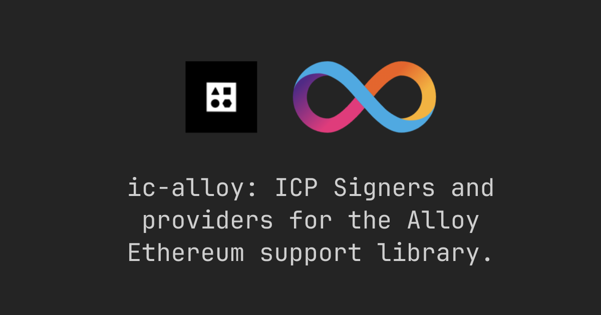

[Alloy](https://alloy.rs/) implements high-performance, well-tested & documented libraries for interacting with Ethereum and other EVM-based chains. This fork of Alloy adds support for the [Internet Computer](https://internetcomputer.org) (ICP) both as a transport layer and as a signer.

`ic-alloy` abstracts away a lot of complexities involved with interacting with an EVM RPC from inside an ICP canister.

Library:

- [ic-alloy](https://github.com/ic-alloy/ic-alloy): The `ic-alloy` library is the Rust crate that you add to you project dependencies. Instead of interacting directly with the ICP EVM RPC canister, you interact with `ic-alloy`.
- Documentation: [ic-alloy.dev](https://ic-alloy.dev)

Examples:

- [ic-alloy-toolkit](https://github.com/ic-alloy/ic-alloy-toolkit): A collection of examples on how to perform common EVM operations. [Live demo](https://u4yi6-xiaaa-aaaap-aib2q-cai.icp0.io)
- [ic-alloy-basic-wallet](https://github.com/ic-alloy/ic-alloy-basic-wallet): A basic Ethereum multi-user wallet. [Live demo](https://7vics-6yaaa-aaaai-ap7lq-cai.icp0.io)
- [ic-alloy-dca](https://github.com/ic-alloy/ic-alloy-dca): A semi-autonomous agent, swapping ERC-20 tokens on Uniswap for you. 

Tools:
- [ic-alloy-evm-rpc-proxy](https://github.com/ic-alloy/ic-alloy-evm-rpc-proxy): Proxy and deduplicate requests to the EVM RPC API on Alchemy.
